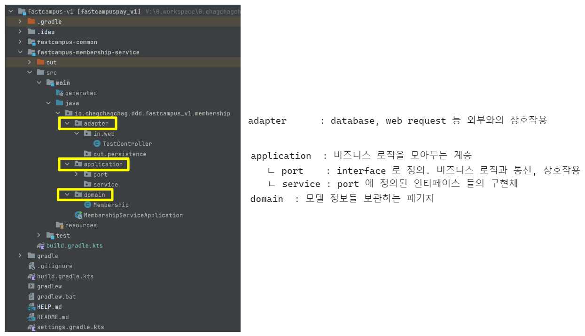
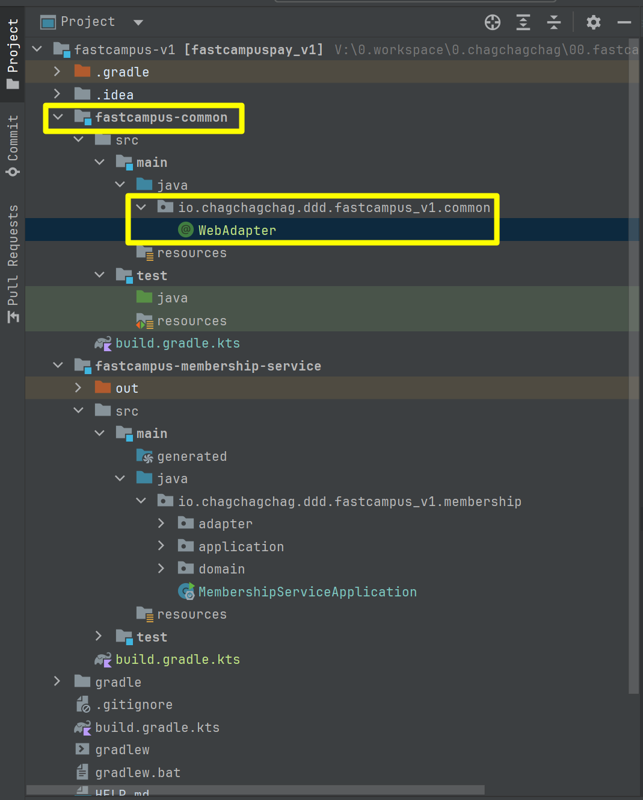
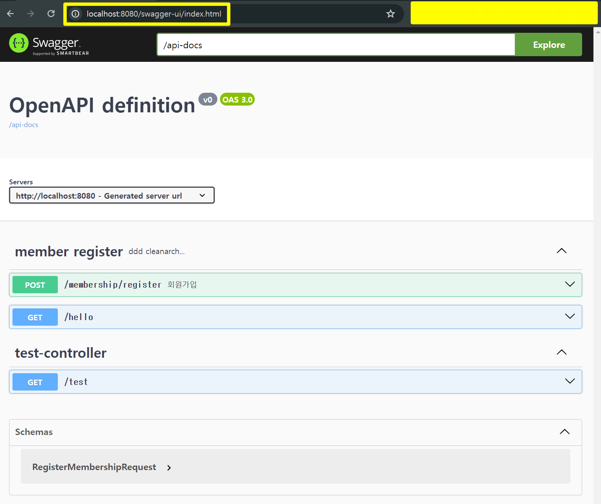
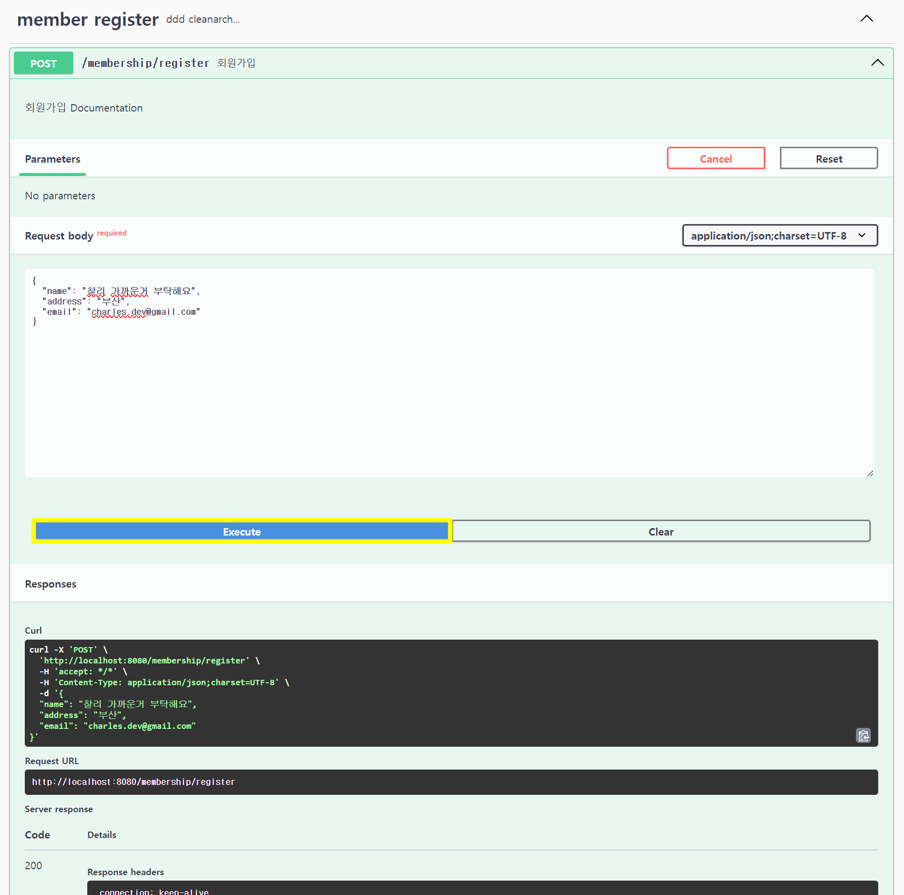
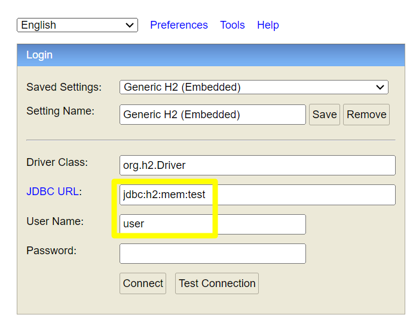
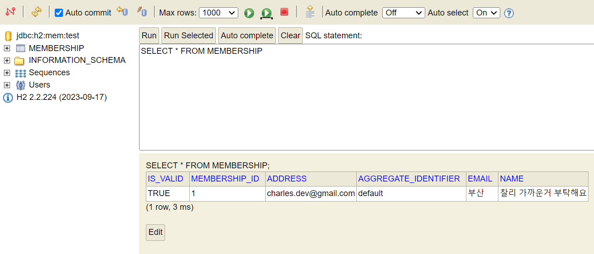

## memo

## 1. membership-service 작업

build.gradle.kts 

```kotlin
dependencies {
	implementation(project(":fastcampus-common"))
	implementation("org.springframework.boot:spring-boot-starter-data-jpa")
	implementation("org.springframework.boot:spring-boot-starter-web")
	implementation("org.springframework.boot:spring-boot-starter-validation")
//	implementation("org.axonframework:axon-configuration:${property("axonVersion")}")
//	implementation("org.axonframework:axon-spring-boot-starter:${property("axonVersion")}")
	implementation("org.springdoc:springdoc-openapi-starter-webmvc-ui:2.5.0")

	compileOnly("org.projectlombok:lombok")
	runtimeOnly("com.h2database:h2")
	runtimeOnly("com.mysql:mysql-connector-j")
	annotationProcessor("org.projectlombok:lombok")
	testImplementation("org.springframework.boot:spring-boot-starter-test")
}
```

<br/>


패키지 구조




SpringBootApplication 소스코드 작성

```java
package io.chagchagchag.ddd.fastcampus_v1.membership;

import org.springframework.boot.SpringApplication;
import org.springframework.boot.autoconfigure.SpringBootApplication;

@SpringBootApplication
public class MembershipServiceApplication {
  public static void main(String[] args) {
    SpringApplication.run(MembershipServiceApplication.class, args);
  }
}
```


adapter/in.web 에 아래의 controller 를 두어서 테스트 해본다.

```java
package io.chagchagchag.ddd.fastcampus_v1.membership.adapter.in.web;

import lombok.RequiredArgsConstructor;
import org.springframework.web.bind.annotation.GetMapping;
import org.springframework.web.bind.annotation.RestController;

@RequiredArgsConstructor
@RestController
public class TestController {
  @GetMapping(path = "/test")
  public String getTest(){
    return "Hello, nice to meet you.";
  }
}
```

<br/>


### Part2. Ch03.02. JPA와 Hexagonal 아키텍처를 활용한 고객 서비스 개발 1

#### domain 영역 - Membership 클래스를 작성

조금 더 클린아키텍처 적으로 접근함.<br/>

Membership 이라는 클래스는 오염이 되면 안되는 도메인 클래스<br/>

- 핵심도메인이며, 고객 정보를 다루기 때문에 오염이 되면 안되기 때문에 final 로 선언하고 생성자의 접근 래벨을 PRIVATE 로 선언

```java
package io.chagchagchag.ddd.fastcampus_v1.membership.domain;

import lombok.AccessLevel;
import lombok.AllArgsConstructor;
import lombok.Getter;

@AllArgsConstructor(access = AccessLevel.PRIVATE)
public class Membership {
  @Getter private final String membershipId;
  @Getter private final String name;
  @Getter private final String email;
  @Getter private final String address;
  @Getter private final boolean isValid;
  @Getter private final boolean isCorp;
}
```

<br/>


그리고 각각의 필드를 @Value 로 관리할 수 있도록 static class 들 만든다. @Value 는 불변객체를 위해서 선언하는 롬복의 어노테이션이다.<br/>

@Value 에 대해서는 [여기](https://siahn95.tistory.com/171) 를 확인하자. 현재 문서작업을 하고 있는 것이 아니라 실습을 하고 있는 중이어서 간단한 메모만 남겨두고 가는중. 몇 일 뒤에 문서화를 제대로 시작할 예정.

```java
package io.chagchagchag.ddd.fastcampus_v1.membership.domain;

import lombok.AccessLevel;
import lombok.AllArgsConstructor;
import lombok.Getter;
import lombok.Value;

@AllArgsConstructor(access = AccessLevel.PRIVATE)
public class Membership {
  @Getter private final String membershipId;
  @Getter private final String name;
  @Getter private final String email;
  @Getter private final String address;
  @Getter private final boolean isValid;
  @Getter private final String aggregateIdentifier;

  public static Membership generateMember(
      MembershipId membershipId, MembershipName membershipName,
      MembershipEmail membershipEmail,
      MembershipAddress membershipAddress,
      MembershipIsValid membershipIsValid,
      MembershipAggregateIdentifier membershipAggregateIdentifier
  ){
    return new Membership(
        membershipId.membershipId,
        membershipName.nameValue,
        membershipEmail.emailValue,
        membershipAddress.addressValue,
        membershipIsValid.isValidValue,
        membershipAggregateIdentifier.aggregateIdentifier
    );
  }

  @Value
  public static class MembershipId {
    public MembershipId(String value){
      this.membershipId = value;
    }
    String membershipId;
  }

  @Value
  public static class MembershipName {
    public MembershipName(String value) {
      this.nameValue = value;
    }

    String nameValue;
  }
  @Value
  public static class MembershipEmail {
    public MembershipEmail(String value) {
      this.emailValue = value;
    }
    String emailValue;
  }

  @Value
  public static class MembershipAddress {
    public MembershipAddress(String value) {
      this.addressValue = value;
    }
    String addressValue;
  }

  @Value
  public static class MembershipIsValid {
    public MembershipIsValid(boolean value) {
      this.isValidValue = value;
    }
    boolean isValidValue;
  }

  @Value
  public static class MembershipAggregateIdentifier {
    public MembershipAggregateIdentifier(String value) {
      this.aggregateIdentifier = value;
    }
    String aggregateIdentifier;
  }
}
```

<br/>


#### Membership entity 정의 

```java
package io.chagchagchag.ddd.fastcampus_v1.membership.adapter.out.persistence;

import jakarta.persistence.Entity;
import jakarta.persistence.GeneratedValue;
import jakarta.persistence.Id;
import jakarta.persistence.Table;
import lombok.AccessLevel;
import lombok.AllArgsConstructor;
import lombok.Getter;
import lombok.NoArgsConstructor;

@Getter
@Entity
@Table(name = "membership")
@AllArgsConstructor
@NoArgsConstructor(access = AccessLevel.PROTECTED)
public class MembershipJpaEntity {
  @Id @GeneratedValue
  private Long membershipId;
  private String name;
  private String address;
  private String email;

  private boolean isValid;

  private String aggregateIdentifier;

  public MembershipJpaEntity(String name, String address, String email, boolean isValid, String aggregateIdentifier) {
    this.name = name;
    this.address = address;
    this.email = email;
    this.isValid = isValid;
    this.aggregateIdentifier = aggregateIdentifier;
  }

  @Override
  public String toString() {
    return "MembershipJpaEntity{" +
        "membershipId=" + membershipId +
        ", name='" + name + '\'' +
        ", address='" + address + '\'' +
        ", email='" + email + '\'' +
        ", isValid=" + isValid +
        ", aggregateIdentifier='" + aggregateIdentifier + '\'' +
        '}';
  }
}
```

<br/>


### Part2. Ch03.03. JPA 와 Hexagonal 아키텍처를 활용한 고객서비스 개발 2

### api 설계

Query 와 Command 로 분류해서 API 를 분류<br/>

Query

- 조회를 위한 용도
- e.g. find - membership (-by -membershipId)
- RequestParam : membershipId
- Response : Membership (membershipId, name, addr, ...)

Command

- 필요한 고객 정보를 받아서 신규 고객 멤버를 생성
- RequestParam : Membership(membershipId, name, addr, ...)
- Response : 등록된 Membership 데이터와 Response Code (200, 201, 400, 500,..)

<br/>


#### @WebAdapter 선언

`@WebAdapter` 를 정의, WebAdapter 임을 알려주는 단순한 애노테이션이고, 실제로 다른 기능을 하지 않는 용도라고 함. 강사님도 스터디를 하면서 다른 외국자료를 보고 가져온 것이라고 이야기해주심.<br/>

```java
package io.chagchagchag.ddd.fastcampus_v1.common;

import java.lang.annotation.Documented;
import java.lang.annotation.ElementType;
import java.lang.annotation.Retention;
import java.lang.annotation.RetentionPolicy;
import java.lang.annotation.Target;
import org.springframework.core.annotation.AliasFor;
import org.springframework.stereotype.Component;

@Target({ElementType.TYPE})
@Retention(RetentionPolicy.RUNTIME)
@Documented
@Component
public @interface WebAdapter {
  @AliasFor(annotation = Component.class)
  String value() default "";
}
```

<br/>


그런데 이 WebAdapter 를 common 에 넣어두겠다고 하셨는데, 불안감이 엄습했다. `이거 왠지 나중에 common 모듈로 분리하겠는데?` 하는 생각이 들어서 `fastcampus-common` 모듈을 새로 만들었다. 그리고 아래의 위치에 위의 코드를 위치시켜줬다. [실제 코드](https://github.com/KimByeongKou/fastcampus-pay/blob/main/common/src/main/java/com/fastcampuspay/common/WebAdapter.java)를 확인해보니 강사님도 common 모듈을 결국 멀티모듈로 분리해뒀다는 것을 확인했다.



<br/>

`fastcampus-common` 모듈의 build.gradle.kts 는 아래와 같이 작성해줬다.

```kotlin
dependencies {
	implementation("org.springframework.boot:spring-boot-starter-validation")
	implementation("org.springframework.boot:spring-boot-starter-web")
    // ... 
}
```

<br/>


그리고 `fastcampus-common` 모듈을 현재 모듈로 불러와야 한다. `fastcampus-membership-service` 모듈 내의 build.gradle.kts 파일에 아래와 같이 common 모듈을 include 하게끔 지정해준다.

```kotlin
// ..

dependencies {
    // ...
    
	implementation(project(":fastcampus-common"))
    
    // ...
}
```

<br/>


#### @PersistenceAdapter, @UseCase

위에서 @WebAdapter 애노테이션을 추가하면서 @PersistenceAdapter, @UseCase 도 함께 추가해줌.

@PersistenceAdapter, @UseCase 를 정의한다.

- @PersistenceAdapter : 영속성 계층에 Adapter 를 의미하는 논리적인 의미만을 담당하는 어노테이션 
- @UseCase : Service 에 해당하는 계층을 표현하기 위한 논리적인 의미만을 담당하는 어노테이션 

<br/>


@PersistenceAdapter

```java
package io.chagchagchag.ddd.fastcampus_v1.common;

import java.lang.annotation.Documented;
import java.lang.annotation.ElementType;
import java.lang.annotation.Retention;
import java.lang.annotation.RetentionPolicy;
import java.lang.annotation.Target;
import org.springframework.core.annotation.AliasFor;
import org.springframework.stereotype.Component;

@Target({ElementType.TYPE})
@Retention(RetentionPolicy.RUNTIME)
@Documented
@Component
public @interface PersistenceAdapter {
  @AliasFor(annotation = Component.class)
  String value() default "";
}
```

<br/>


@UseCase

```java
package io.chagchagchag.ddd.fastcampus_v1.common;

import java.lang.annotation.Documented;
import java.lang.annotation.ElementType;
import java.lang.annotation.Retention;
import java.lang.annotation.RetentionPolicy;
import java.lang.annotation.Target;
import org.springframework.core.annotation.AliasFor;
import org.springframework.stereotype.Component;

@Target({ElementType.TYPE})
@Retention(RetentionPolicy.RUNTIME)
@Documented
@Component
public @interface UseCase {
  @AliasFor(annotation = Component.class)
  String value() default "";
}
```

<br/>


#### SelfValidating 

SelfValidating 클래스 역시 추가해준다. common 패키지에 클래스를 추가하는 김에 SelfValidating 클래스 까지 추가해줬다.

```java
package io.chagchagchag.ddd.fastcampus_v1.common;

import jakarta.validation.ConstraintViolation;
import jakarta.validation.ConstraintViolationException;
import jakarta.validation.Validation;
import jakarta.validation.Validator;
import jakarta.validation.ValidatorFactory;
import java.util.Set;

public abstract class SelfValidating<T> {
  private Validator validator;

  public SelfValidating() {
    ValidatorFactory factory = Validation.buildDefaultValidatorFactory();
    validator = factory.getValidator();
  }

  /**
   * Evaluates all Bean Validations on the attributes of this
   * instance.
   */
  protected void validateSelf() {
    Set<ConstraintViolation<T>> violations = validator.validate((T) this);
    if (!violations.isEmpty()) {
      throw new ConstraintViolationException(violations);
    }
  }
}
```


#### RegisterMembershipController

Controller 의 코드는 아래와 같이 작성한다. `adapter.in.web` 패키지이다.

처음에 작성했던 TestController 의 이름을 RegisterMembershipController 로 바꿔줬다.

```java
package io.chagchagchag.ddd.fastcampus_v1.membership.adapter.in.web;

import io.chagchagchag.ddd.fastcampus_v1.common.WebAdapter;
import lombok.RequiredArgsConstructor;
import org.springframework.web.bind.annotation.PostMapping;
import org.springframework.web.bind.annotation.RequestBody;
import org.springframework.web.bind.annotation.RestController;

@WebAdapter
@RequiredArgsConstructor
@RestController
public class RegisterMembershipController {
  @PostMapping(path = "/membership/register")
  public String register(@RequestBody RegisterMembershipRequest request){
    // request 받기

    // request → command 변환 작업 수행 
      
    // Use case 처리

    return "Hello, nice to meet you.";
  }
}
```

`RegisterMembershipController` 클래스의 역할은 아래와 같다.

- request 받기
- request → command 변환 작업 수행
- use case 처리

<br/>


#### RegisterMembershipUseCase

use case 는 실제 사용될 케이스를 의미하는데, 이렇게 실제 사용 예 라는 것을 interface 화 할 것이디. <br/>

위치는 `application.port.in` 패키지다.<br/>

그리고 이 interface 를 implements 하는 것은 `application.service` 패키지에서 implements 하도록 할 것이다.<br/>

```java
package io.chagchagchag.ddd.fastcampus_v1.membership.application.port.in;

public interface RegisterMembershipUseCase {
  void registerMembership(RegisterMembershipCommand command);
  void registerAxonMembership(RegisterMembershipCommand command);
}
```

<br/>

`RegisterMembershipCommand` 는 아래에서 생성한다.


#### RegisterMembershipCommand

RegisterMembershipCommand 는 Controller 내에서 아래와 같이 변환되게끔 할 예정이다.

```java
@WebAdapter
@RequiredArgsConstructor
@RestController
public class RegisterMembershipController {
  @PostMapping(path = "/membership/register")
  public String register(@RequestBody RegisterMembershipRequest request){
    // request 받기

    // request → command 변환 작업 수행 
      
    // Use case 처리

    return "Hello, nice to meet you.";
  }
}
```

<br/>


##### 사용자로부터 받은 request 를 command 로 변환해서 사용하는 이유

사용자로부터 받은 request 는 바로 사용하지 않는다. request 의 원본은 그대로 두고, Command 라고 하는 객체를 통해 Use case 처리를 한다. 이렇게 하는 이유는 강의에서는 추상화 개념을 이야기해줬지만, 내 생각은 이렇다. Request 의 경우 frontend 등의 요구사항에 의해 굉장히 자주 변하는 사항이며 validation 작업 역시 굉장히 많다. 그런데 이 request 를 use case 에서 그대로 받아서 처리한다면 use case 에서도 request 에 의존을 하게 된다. <br/>

이런 의존성을 끊기 위해서 Use Case 에서의 작업 처리는 Command 로 변환 후에 작업을 하게끔 하는 것이라고 이해를 했다.<br/>


##### RegisterMembershipCommand.java

RegisterMembershipCommand.java 의 내용은 아래와 같다.

```java
package io.chagchagchag.ddd.fastcampus_v1.membership.application.port.in;

import jakarta.validation.constraints.NotNull;
import lombok.Builder;
import lombok.Data;
import lombok.EqualsAndHashCode;

@Builder
@Data
@EqualsAndHashCode(callSuper = false)
public class RegisterMembershipCommand {
  @NotNull
  private final String name;

  @NotNull
  private final String email;

  @NotNull
  private final String address;

  @NotNull
  private final boolean isValid;

  public RegisterMembershipCommand(String name, String email, String address, boolean isValid) {
    this.name = name;
    this.email = email;
    this.address = address;
    this.isValid = isValid;
  }
}
```

<br/>


#### RegisterMembershipController 구현 작업 (1) : request → command & usecase 호출

```java
@WebAdapter
@RequiredArgsConstructor
@RestController
public class RegisterMembershipController {

  private final RegisterMembershipUseCase registerMembershipUseCase;

  @PostMapping(path = "/membership/register")
  @Operation(summary = "회원가입", description = "회원가입")
  public void register(@RequestBody RegisterMembershipRequest request){
    // request 받기

    // request → command 변환 작업 수행
    RegisterMembershipCommand command = RegisterMembershipCommand.builder()
        .name(request.getName())
        .address(request.getAddress())
        .email(request.getEmail())
        .isValid(true)
        .build();

    // Use case 처리
    registerMembershipUseCase.registerMembership(command);
  }
}
```

참고 : 위의 코드까지는 registerMembershipUseCase.registerMembership(command) 메서드가 Membership 을 return 하고 있는데 뒤에서 axon framework 기반의 eda 구조로 전환하면, void 를 return 하는 메서드 구조로 변경한다. <br/>


#### Service 정의 : UseCase implements

UseCase 구체타입을 implements 하기에 앞서서 정의할 동작들을 정리해보면 아래와 같다.

```java
package io.chagchagchag.ddd.fastcampus_v1.membership.application.service;

// ...

@RequiredArgsConstructor
@UseCase
@Transactional
public class RegisterMembership implements RegisterMembershipUseCase {

  @Override
  public void registerMembership(RegisterMembershipCommand command) {
    // command → DB

    // 비즈니스 로직 → DB
    // -- DB 에 접근하는 것은 external system 과의 통신.
    // -- 따라서 port, adapter 를 통해서 통신

  }

  @Override
  public void registerAxonMembership(RegisterMembershipCommand command) {

  }
}
```

<br/>


##### `application.port.out.RegisterMembershipPort` 정의

```java
package io.chagchagchag.ddd.fastcampus_v1.membership.application.port.out;

import io.chagchagchag.ddd.fastcampus_v1.membership.domain.Membership;

public interface RegisterMembershipPort {
  void createMembership(
      Membership.MembershipName membershipName
      , Membership.MembershipEmail membershipEmail
      , Membership.MembershipAddress membershipAddress
      , Membership.MembershipIsValid membershipIsValid
      , Membership.MembershipAggregateIdentifier membershipAggregateIdentifier
  );
}
```

<br/>


##### `adapter.port.out.persistence` : MembershipPersistenceAdapter 정의

> https://github.com/KimByeongKou/fastcampus-pay/blob/main/membership-service/src/main/java/com/fastcampuspay/membership/adapter/out/persistence/MembershipPersistenceAdapter.java

PersistenceAdapter 의 역할은 실제 기술계층인 Spring Data Repository 컴포넌트의 인스턴스를 주입받고 이 인스턴스를 통해서 DB에 접근하는 실제 물리적인 기능을 수행한다. 이 기능을 역할로 분류한 것은 위에서 살펴봤던 `application.port.out.RegisterMembershipPort` interface 이다.

```java
package io.chagchagchag.ddd.fastcampus_v1.membership.adapter.out.persistence;
// ...
@RequiredArgsConstructor
@PersistenceAdapter
public class MembershipPersistenceAdapter implements RegisterMembershipPort{
  private final SpringDataMembershipRepository membershipRepository;

  @Override
  public void createMembership(
      MembershipName membershipName,
      MembershipEmail membershipEmail,
      MembershipAddress membershipAddress,
      MembershipIsValid membershipIsValid,
      MembershipAggregateIdentifier membershipAggregateIdentifier
  ){
    membershipRepository.save(
        new MembershipJpaEntity(
            membershipName.getNameValue(),
            membershipEmail.getEmailValue(),
            membershipAddress.getAddressValue(),
            membershipIsValid.isValidValue(),
            membershipAggregateIdentifier.getAggregateIdentifier()
        )
    );
  }
}
```

<br/>


##### `adapter.port.out.persistence` : SpringDataMembershipRepository 정의

위에서 살펴봤던 SpringDataMembershipRepository 은 아래와 같다. 간단한 Jpa Repository 코드이다.

```java
package io.chagchagchag.ddd.fastcampus_v1.membership.adapter.out.persistence;

import org.springframework.data.jpa.repository.JpaRepository;

public interface SpringDataMembershipRepository extends JpaRepository<MembershipJpaEntity, Long> {
}
```

<br/>


##### `application.service.RegisterMembership` 정의

결과적으로는 아래의 코드로 작성해줬다. RegisterMembershipPort 의 createMembership() 메서드를 호출함을 명시한다. RegisterMembershipPort 의 구현체는 `MembershipPersistenceAdapter` 이며, 실제 동작은 MembershipPersistenceAdapter 내의 createMembership() 메서드를 통해서 데이터베이스 저장 등의 동작을 수행하게 된다.

```java
@RequiredArgsConstructor
@UseCase
@Transactional
public class RegisterMembership implements RegisterMembershipUseCase {
  private final RegisterMembershipPort registerMembershipPort;

  @Override
  public void registerMembership(RegisterMembershipCommand command) {
    registerMembershipPort.createMembership(
        new Membership.MembershipName(command.getName()),
        new Membership.MembershipEmail(command.getEmail()),
        new Membership.MembershipAddress(command.getAddress()),
        new Membership.MembershipIsValid(command.isValid()),
        new Membership.MembershipAggregateIdentifier("default")
    );
  }

  @Override
  public void registerAxonMembership(RegisterMembershipCommand command) {

  }
}
```

<br/>


##### `adapter.out.persistence.MembershipMapper`

https://github.com/KimByeongKou/fastcampus-pay/blob/main/membership-service/src/main/java/com/fastcampuspay/membership/adapter/out/persistence/MembershipMapper.java<br/>

강의 초반이라 Database 에 데이터를 저장 직후에 Jpa Entity 를 바로 비즈니스 모델인 `Membership` 객체로 변환하는 `mapToDomainEntity(Entity)` 함수를 정의한다. 이 함수는 `MembershipMapper` 내에 정의하는데 참고로 이 코드는 나중에 가서는 Find 쿼리에서만 호출하게 된다.

```java
package io.chagchagchag.ddd.fastcampus_v1.membership.adapter.out.persistence;

import io.chagchagchag.ddd.fastcampus_v1.membership.domain.Membership;
import org.springframework.stereotype.Component;

@Component
public class MembershipMapper {
  Membership mapToDomainEntity(
      MembershipJpaEntity membership) {
    System.out.println(membership.toString());
    return Membership.generateMember(
        new Membership.MembershipId(membership.getMembershipId()+""),
        new Membership.MembershipName(membership.getName()),
        new Membership.MembershipEmail(membership.getEmail()),
        new Membership.MembershipAddress(membership.getAddress()),
        new Membership.MembershipIsValid(membership.isValid()),
        new Membership.MembershipAggregateIdentifier(membership.getAggregateIdentifier())
    );
  }
}
```

<br/>


##### skip

이후의 mapper 로직 작성 부분 필기는 생략. 사소한 내용들이기에 강의자료를 보고 금방 따라갈 수 있다.

<br/>


### h2 설정

```kotlin
dependencies {
	runtimeOnly("com.h2database:h2")
    // ...
}
```

<br/>


application.yml

```yaml
spring:
  h2:
    console:
      enabled: true
      path: /h2-console
  datasource:
    driver-class-name: org.h2.Driver
    url: jdbc:h2:mem:test
    username: user
    password:
  jpa:
    hibernate:
      ddl-auto: create-drop
```

<br/>


구동해보고 정상 확인함<br/>

<br/>


### spring doc 설정 

springfox 의 swagger 는 Spring 3.x 부터는 사용이 불가하다. 그래서 springdoc 를 사용하기로 함.<br/>

springfox 와 다른 점은 [Differentiation to Springfox project](https://springdoc.org/#differentiation-to-springfox-project) 에서 확인 가능함.<br/>

Spring Doc 에 대한 자세한 설명은 https://springdoc.org/ 에서 확인 가능하다. <br/>

[https://springdoc.org](https://springdoc.org) 에서는 webflux 역시 지원하고 있으며 관련된 항목은 [Spring-webflux/webmvc fn Functional Endpoint](https://springdoc.org/#spring-webfluxwebmvc-fn-with-functional-endpoints) 에서 확인 가능하다.<br/>

<br/>


참고자료

- Spring Doc Official : [springdoc.org](https://springdoc.org/)
- Springdoc-openapi Properties : [Springdoc-openapi Properties](https://springdoc.org/#properties)
- springfox 와 다른 점 :  [Differentiation to Springfox project](https://springdoc.org/#differentiation-to-springfox-project)
- webflux 의 함수형 엔드포인트 지원 방식 : [Spring-webflux/webmvc fn Functional Endpoint](https://springdoc.org/#spring-webfluxwebmvc-fn-with-functional-endpoints)

<br/>


#### 의존성 추가

3.x 이전 버전

```kotlin
implementation("org.springdoc:springdoc-openapi-ui:1.7.0")
```

3.x 이후 버전

```kotlin
implementation("org.springdoc:springdoc-openapi-starter-webmvc-ui:2.5.0")
```

<br/>


#### application.yml

```yaml
springdoc:
  default-consumes-media-type: application/json;charset=UTF-8
  default-produces-media-type: application/json;charset=UTF-8
  api-docs:
    path: /api-docs
    enabled: true # for dev
  swagger-ui:
    enabled: true # for dev
    path: /swagger-ui.html
    try-it-out-enabled: true
  packages-to-scan: io.chagchagchag.ddd.fastcampus_v1.membership.adapter.in.web
  cache:
    disabled: true
  version: v1

```

<br/>


#### 테스트

위에서 `springdoc.swagger-ui.path` 에 설정한 경로인 http://localhost:8080/swagger-ui.html 로 접속해보면 아래와 같은 화면이 나타난다. 주소가 http://localhost:8080/swagger-ui/index.html 로 리다이렉팅 되었음을 확인 가능하다.



<br/>


#### 부가 설정

Swagger 에 대해 별도의 설정을 해준다.<br/>

application.yml 파일에는`springdoc.version` 항목을 추가해줬다. 커스텀한 설정이고, springdoc 에서 지원하는 항목은 아니다. 그냥 애플리케이션 레벨에서 필요한 key/value 를 @Value 애노테이션으로 읽어들일 항목을 추가해줬다.

```yaml
# ...
springdoc:
  # ...
  version: v1
  # ...
```

<br/>


#### SpringDocConfig.java

설정 코드는 아래와 같이 추가해줬다.

```java
package io.chagchagchag.ddd.fastcampus_v1.membership.config;

import io.swagger.v3.oas.models.Components;
import io.swagger.v3.oas.models.OpenAPI;
import io.swagger.v3.oas.models.info.Contact;
import io.swagger.v3.oas.models.info.Info;
import org.springframework.beans.factory.annotation.Value;
import org.springframework.context.annotation.Bean;
import org.springframework.context.annotation.Configuration;

@Configuration
public class SpringDocConfig {
  @Bean
  public OpenAPI openAPI(
      @Value("${springdoc.version}") String version
  ){
    Info info = new Info()
        .title("패캠페이 v1")
        .version(version)
        .description("패스트캠퍼스 간편결제 시스템 MSA 구축")
        .contact(new Contact().name("chagchagchag").email("chagchagchag.dev@gmail.com"));

    return new OpenAPI().info(info).components(new Components());
  }
}
```

<br/>


#### 패키지 스캔 설정

```yaml
# ...
springdoc:
  # ...
  packages-to-scan: io.chagchagchag.ddd.fastcampus_v1.membership.adapter.in.web
```

<br/>


#### dev,prod 에 따라 swagger disable 하기

예를 들면 dev 프로필에서는 아래와 같이 설정하면 swagger 가 적용된다.

```yaml
springdoc:
  default-consumes-media-type: application/json;charset=UTF-8
  default-produces-media-type: application/json;charset=UTF-8
  api-docs:
    path: /api-docs
    enabled: true # for dev
  swagger-ui:
    enabled: true # for dev
    path: /swagger-ui.html
    try-it-out-enabled: true
  packages-to-scan: io.chagchagchag.ddd.fastcampus_v1.membership.adapter.in.web
  cache:
    disabled: true
  version: v1
```

<br/>

prod 프로필에서는 아래와 같이 설정하면 swagger 가 disabled 된다.

```yaml
springdoc:
  default-consumes-media-type: application/json;charset=UTF-8
  default-produces-media-type: application/json;charset=UTF-8
  api-docs:
    path: /api-docs
    enabled: false
  swagger-ui:
    enabled: false
    path: /swagger-ui.html
    try-it-out-enabled: true
  packages-to-scan: io.chagchagchag.ddd.fastcampus_v1.membership.adapter.in.web
  cache:
    disabled: true
  version: v1
```


#### 주요 애노테이션 들

spring fox 에서 사용하던 애노테이션들은 아래와 같이 변경됨

- @Api → @Tag
- @ApiIgnore 은 아래와 같이 spring docs 에서 표현 가능
  - @Parameter(hidden) 또는 
  - @Operation(hidden = true) 또는
  - @Hidden
- @ApiImplicitParam → @Parameter
- @ApiImplicitParams → @Parameters
- @ApiModel → @Schema
- @ApiModelProperty 
- @ApiModelProperty(hidden = true) → @Schema(accessMode = READ\_ONLY)
- @ApiOperation(value = "aaa", notes = "bbb") → @Operation(summary = "aaa", description = "bbb")
- @ApiParam → @Parameter
- @ApiResponse(code = 404, message = "not found") → @ApiResponse(responseCode = "404", description = "bbb")

<br/>


### swagger 로 api 테스트




### 데이터 확인 (h2-console)

[http://localhost:8080/h2-console](http://localhost:8080/h2-console) 로 접속해서 확인 



<br/>


아래와 같이 잘 insert 되었음을 확인 가능




## 멤버 조회 API 구현

### FindMembershipController

https://github.com/KimByeongKou/fastcampus-pay/blob/main/membership-service/src/main/java/com/fastcampuspay/membership/adapter/in/web/FindMembershipController.java<br/>

조회를 위한 컨트롤러를 아래와 같이 작성

```java
package io.chagchagchag.ddd.fastcampus_v1.membership.adapter.in.web;

import io.chagchagchag.ddd.fastcampus_v1.common.WebAdapter;
import io.chagchagchag.ddd.fastcampus_v1.membership.application.port.in.FindMembershipCommand;
import io.chagchagchag.ddd.fastcampus_v1.membership.application.port.in.FindMembershipUseCase;
import io.chagchagchag.ddd.fastcampus_v1.membership.domain.Membership;
import io.swagger.v3.oas.annotations.Operation;
import io.swagger.v3.oas.annotations.Parameter;
import io.swagger.v3.oas.annotations.Parameters;
import io.swagger.v3.oas.annotations.tags.Tag;
import lombok.RequiredArgsConstructor;
import org.springframework.http.ResponseEntity;
import org.springframework.web.bind.annotation.GetMapping;
import org.springframework.web.bind.annotation.PathVariable;
import org.springframework.web.bind.annotation.RestController;

@Tag(name = "member find", description = "회원조회")
@WebAdapter
@RestController
@RequiredArgsConstructor
public class FindMembershipController {
  private final FindMembershipUseCase findMembershipUseCase;
  @GetMapping(path = "/membership/{membershipId}")
  @Parameters(value = {
      @Parameter(name = "membershipId", description = "회원 id", example = "1")
  })
  @Operation(summary = "회원조회", description = "회원조회")
  ResponseEntity<Membership> findMembershipByMemberId(@PathVariable(name = "membershipId") String membershipId){
    FindMembershipCommand command = FindMembershipCommand.builder()
        .membershipId(membershipId)
        .build();
    return ResponseEntity.ok(findMembershipUseCase.findMembership(command));
  }

  @GetMapping(path = "/membership/axon/{membershipId}")
  ResponseEntity<Membership> findAxonMembershipByMemberId(@PathVariable String membershipId){
    return null;
  }
}
```

<br/>

위의 코드에서 `FindMembershipCommand` 는 아래에서 작성 예정<br/>


### FindMembershipCommand

강의에서는 FindMembershipRequest 를 작성 중이지만, 작성이 완료된 버전의 코드를 보면 FindMembershipCommand 를 사용하는 버전으로 변경됨. 따라서 FindMembershipCommand 정의를 옮겨보면 아래와 같다.<br/>

`application.port.in.FindMembershipCommand`

```java
package io.chagchagchag.ddd.fastcampus_v1.membership.application.port.in;

import io.chagchagchag.ddd.fastcampus_v1.common.SelfValidating;
import lombok.Builder;
import lombok.Data;
import lombok.EqualsAndHashCode;

@Data
@Builder
@EqualsAndHashCode
public class FindMembershipCommand extends SelfValidating<FindMembershipCommand> {
  private final String membershipId;
}
```

<br/>


### FindMembershipUseCase

그리고 이번에는 실제 데이터를 조회해오는 FindMembershipUseCase 를 작성해보면 아래와 같다.<br/>

`application.port.in.FindMembershipUseCase`

```java
package io.chagchagchag.ddd.fastcampus_v1.membership.application.port.in;

import io.chagchagchag.ddd.fastcampus_v1.membership.domain.Membership;

public interface FindMembershipUseCase {
  Membership findMembership(FindMembershipCommand command);
  Membership findAxonMembership(FindMembershipCommand command);
}
```

<br/>


### application.service.FindMembership.java

이제 위에서 작성했던 UseCase 인 FindMembershipUsecase 를 implements 한 service 인 FindMembership 클래스를 작성할 차례다.

```java
package io.chagchagchag.ddd.fastcampus_v1.membership.application.service;

import io.chagchagchag.ddd.fastcampus_v1.common.UseCase;
import io.chagchagchag.ddd.fastcampus_v1.membership.application.port.in.FindMembershipCommand;
import io.chagchagchag.ddd.fastcampus_v1.membership.application.port.in.FindMembershipUseCase;
import io.chagchagchag.ddd.fastcampus_v1.membership.application.port.out.FindMembershipPort;
import io.chagchagchag.ddd.fastcampus_v1.membership.domain.Membership;
import lombok.RequiredArgsConstructor;
import org.springframework.transaction.annotation.Transactional;

@RequiredArgsConstructor
@UseCase
@Transactional
public class FindMembership implements FindMembershipUseCase {
  private final FindMembershipPort findMembershipPort;
  @Override
  public Membership findMembership(FindMembershipCommand command) {
    return findMembershipPort.findMembership(new Membership.MembershipId(command.getMembershipId()));
  }

  @Override
  public Membership findAxonMembership(FindMembershipCommand command) {
    return null;
  }
}
```

<br/>


FindMembershipPort 를 정의해줘야 한다.


### FindMembershipPort.java

FindMembershipPort 는 application.port.out 에 명시한 out 방향으로의 Port 명세이다.

```java
package io.chagchagchag.ddd.fastcampus_v1.membership.application.port.out;

import io.chagchagchag.ddd.fastcampus_v1.membership.domain.Membership;
import io.chagchagchag.ddd.fastcampus_v1.membership.domain.Membership.MembershipId;

public interface FindMembershipPort {
  Membership findMembership(MembershipId membershipId);
}
```

위와 같이 작성한 out 방향으로의 Port 명세는 실제 구현체를 만들어줘야 하는데, 이것은 adapter 에 정의한다.

<br/>


### MembershpiPersistenceAdapter.java

위에서 작성한 MembershipPersistenceAdapter 에 `FindMembershipPort` 를 추가로 implements 해주고 findMembership() 메서드를 작성해준다. 추가해준 부분만 표시해보면 아래와 같다.

```java
package io.chagchagchag.ddd.fastcampus_v1.membership.adapter.out.persistence;
/ ...
    
@RequiredArgsConstructor
@PersistenceAdapter
public class MembershipPersistenceAdapter implements RegisterMembershipPort, FindMembershipPort { // FindMembershipPort 를 추가로 implements 해줌
  private final SpringDataMembershipRepository membershipRepository; 
  private final MembershipMapper membershipMapper; // 추가
    
  // ...
  
  @Override // implements
  public Membership findMembership(MembershipId membershipId) {
	// Optional 처리
    return membershipRepository.findById(Long.parseLong(membershipId.getMembershipId()))
        .map(entity -> membershipMapper.mapToDomainEntity(entity))
        .orElseThrow(() -> new IllegalArgumentException("회원이 존재하지 않습니다."));
  }
}
```

<br/>


### 테스트

서버 재기동 후 swagger 에서 멤버 추가, h2 Database 조회, memberId 를 기반으로 swagger 에서 멤버 조회를 해보면 정상적으로 잘 수행됨을 확인 가능하다.


