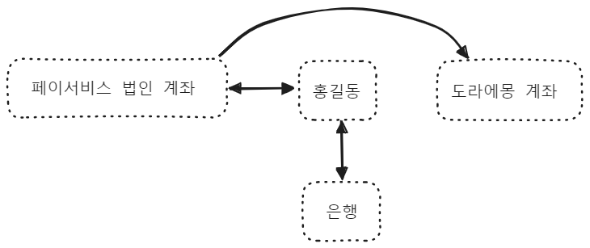
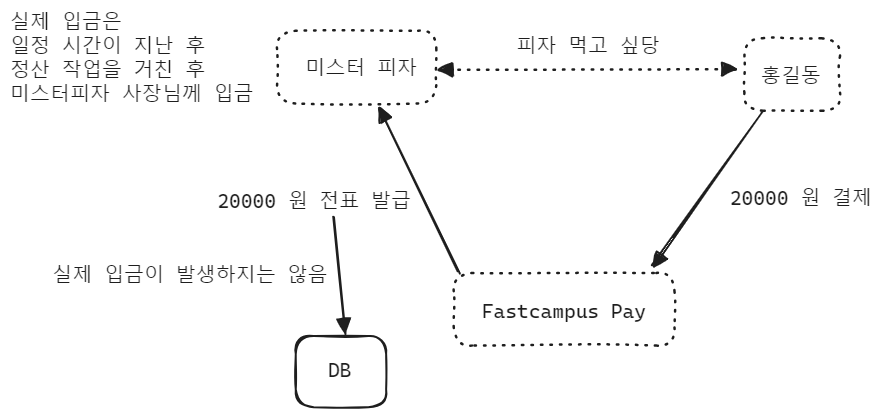
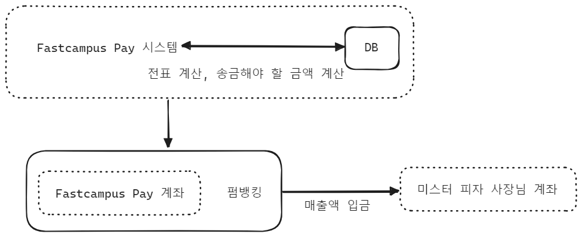

## Part2. Ch04.01

## 선불충전 금액이란?

홍길동이라는 회원이 패캠페이에 가입해서 20만원을 충전하는 절차는 아래와 같다.

**Step1. 계좌등록** 

실제로 패캠페이에 20만원이라는 `머니` 를 충전하려면 `계좌` 라는 존재가 실제로 존재해야 한다. 이런 이유로 페이서비스 등록 시 연결할 계좌를 먼저 등록하는 절차를 거치게 된다. 

**Step2. 계좌 → Fastcampus Pay 법인으로 20만원 이체** 

20만원을 Fastcampus Pay 에 이체해야 한다. 

**Step3. Fastcampus Pay 로 이체 완료되었다는 응답 수신** 

Fastcampus Pay 로 이체 완료되었다는 응답을 수신받은 후 다음단계로 진행 

**Step4. Fastcampus Pay 시스템 내의 홍길동의 잔고를 업데이트** 

Fastcampus Pay 법인 계좌로 이체가 완료가 되었다는 응답을 받은 후 Fastcampus Pay 내의 홍길동의 잔고를 실질적으로 업데이트 수행. SQL 등을 통해 데이터를 업데이트 

`머니` 라는 것은 선불 충전 금액을 의미하며, 이 선불충전 금액을 충전하려면 

- 계좌가 필수적으로 패캠페이 내의 홍길동 회원에 대해서 등록되어 있어야 하며
- 이렇게 연결된 계좌를 통해서 충전을 해야 하게 되는데,
- 이 금액은 결국 패캠페이의 법인 계좌에 입금되어 있어야 하며, 이것을 패캠머니라고 불린다.

 

이런 이유로 어딘가에 송금할 때에는 반드시 머니가 충전되어 있어야 한다. 

페이 서비스들이 충전 이벤트를 자주 하는 이유는 충전이 많이 되면, 페이 시스템 내의 현금이 늘어나고, 여기에 대해 이자가 생긴다거나 하는 부수적인 효과가 있다. 

 

## 펌뱅킹이란 ?

기존 페이시스템들의 공통점

- 항상 특이하게도 10000 원씩만 충전이 된다.
- 결제시 10000원이 넘으면 정확한 금액으로 충전.
  - 11000원을 충전하려고 하면 정확하게 11000원이 충전
  - 8000원을 충전하려고 하면 불가능하고, 기본적으로 최소 10000원까지만 충전 가능
- 페이 서비스마다 송금 메뉴를 관찰해보면 이체 가능한 은행 목록이 다르다.

펌뱅킹 이란?

- 은행의 기능을 시스템적으로 이용하기 위한 하나의 수단 
- 은행의 펌뱅킹 시스템 사용하는 회사는 펌뱅킹 기능을 사용 시 마다 은행에 수수료를 지불해야 함
  - 은행 간의 거래, 은행 계좌 끼리의 돈의 이동을 의미
  - 입/출금 이행 요청시에 항상 고정 금액 수수료를 지불하게 됨
- 펌뱅킹 시스템은 페이서비스 법인과 은행사이에 펌뱅킹 서비스 이용 등록을 해야 이용 가능
  - 따라서 페이서비스가 계약을 맺은 은행의 펌뱅킹을 통해서만 송금이 가능하기에 송금메뉴에 이체 가능한 은행 목록이 다르게 나타나는 것

10000원 보다 낮게 충전을 허용하면?

- 10000원 보다 낮은 금액을 충전하게 되면 펌뱅킹시 금액 상관 없이 소모되는 기본적인 수수료 500원(예시)으로 인해 손해(적자)가 발생

 

## Part2. Ch04.02

## 송금 기능 이해

- 패캠페이 회원 → 패캠페이 회원 으로의 송금
  - 서비스 로직, DB Transaction
- 패캠페이 회원 → 패캠페이 비회원의 계좌로 송금
  - 은행 상태 체크 (은행 점검시간, 수신가능 상태 등등 주기적으로 체크)
  - 입/출금 금액 관리
  - 법인 계좌 컨트롤 
  - 이외 기타 작업들

 

**패캠페이 회원 → 패캠페이 회원으로의 송금** 

외부로 현금이 유출되지 않는다. 페이서비스 법인 계좌의 예치금은 그대로이고, Database 내에서 송금자의 송금액을 차감하고, 수금자의 잔고에 송금액을 더하면 된다. Database 내의 잔고 데이터만 변하며 외부로 예치금이 유출되지 않음 

 

**패캠페이 회원 → 패캠페이 비회원의 계좌로 송금** 

외부로 현금이 유출된다. 

페이서비스 법인 계좌의 예치금이 외부로 이체된다. 

 

## 결제 기능 이해

**"결제" 는 전표를 생성하는 과정**이다. 

- 홍길동이 피자를 먹고 싶다
- 미스터 피자는 패캠페이 가맹점으로 등록했다.
- 홍길동이 패캠페이로 결제를 수행
- 패캠페이 시스템은 미스터 피자 사장님에 대해 전표를 발급
- 이때 패캠페이에서 미스터피자로의 실제 입금은 즉시 이뤄지지 않는다.
- 일정 시간이 지난 후 패캠페이 정산 작업을 거친 후 미스터 피자 사장님께 입금이 일어난다.

 

## 정산 기능 이해

**"정산"은 전표를 통해 돈을 +/- 작업을 통해 정리하는 작업**이다. 

- 정산 주기 : 실제 사장님들의 매출금액이 계산되어 패캠페이에서 사장님께 입금되는 주기
- 가맹점 사장님은 수수료를 내야 한다.

- 패캠페이 입장에서는 정산 주기가 늦을 수록 좋다. 
  - 패캠페이 계좌에 입금된 돈이 계좌에 오래 있을 수록 이자수익이 있기 때문
  - 정산 주기가 짧아질 수록 이자 수익이 줄어든다.

 

## 필요 기능 정의

회원 가입 정보 변경 기능

- Membership 서비스에 "계좌연결" 기능이 추가로 필요하다.

 

송금 기능 (회원 → 회원, 회원 → 비회원 은행계좌)

- 회원 간 잔액 이동 비즈니스로직
- banking 모듈 (실제 외부 은행 관리 시스템)

 

가맹점의 결제 기능 + 정산기능

- 가맹점 관리 시스템 + 계좌 등록 필요
- 결제 시스템
- 정산 기능 (e.g. 크론잡)

